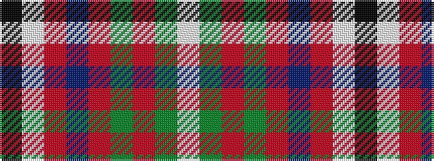

KWRBRGRGW

It is a 9 stripe tartan.

<figure class="pat-woven">

<figcaption>idealised sample</figcaption>
</figure>

## Colour Sequence



## Tartans with this colour sequence

| Tartans |
|---------------|
| [Oliver Dress (Dance)](/setts/s9/k1w7r6db7r1g1r1g1w1~x4/)|
||
| [Oliver Dress, Pink (Dance?)](/setts/s9/w5g3r3g3r3t20r16w21k3~x2/)|
||
| [Oliver, dress](/setts/s9/w5g3r3g3r3db20r16w21k3~x2/)|
||
