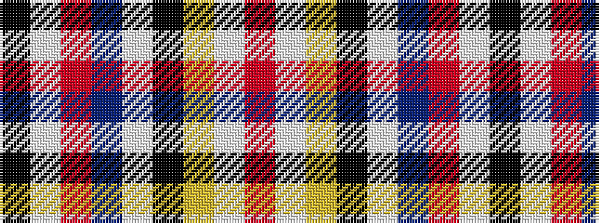

KWRBWKYWR

It is a 9 stripe tartan.

<figure class="pat-woven">

<figcaption>idealised sample</figcaption>
</figure>

## Colour Sequence



## Tartans with this colour sequence

| Tartans |
|---------------|
| [Craparo](/variants/s9/r3w6ly4k25w3n30o30w3k2~x2/)|
||
