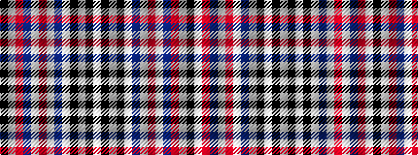

KWRBWRWBWKWKW

It is a 13 stripe tartan.

<figure class="pat-woven">

<figcaption>idealised sample</figcaption>
</figure>

## Colour Sequence



## Tartans with this colour sequence

| Tartans |
|---------------|
| [Spirit of South Korea](/variants/s13/w8k4w2k4w24n2w1r2w1n12r12w8k2~x2/)|
||
| [Spirit of South Korea (Fashion)](/variants/s13/w8k4w2k4w24db2w1r2w1db12r12w8k2~x2/)|
||
