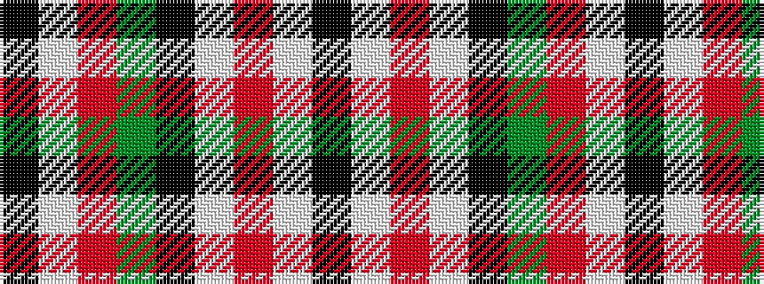

KWRGKWRWK

It is a 9 stripe tartan.

<figure class="pat-woven">

<figcaption>idealised sample</figcaption>
</figure>

## Colour Sequence



## Tartans with this colour sequence

| Tartans |
|---------------|
| [MacNaughton](/setts/s9/k1lb1r16dg16k12lb8r16lb1k1~x2/)|
||
