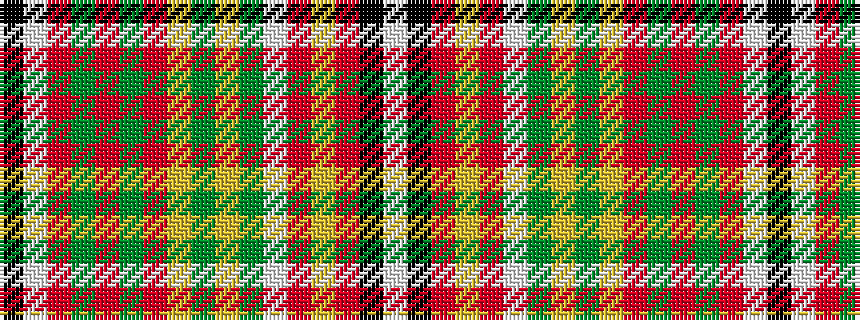

KWRGRGRYGYGWRYRKW

It is a 17 stripe tartan.

<figure class="pat-woven">

<figcaption>idealised sample</figcaption>
</figure>

## Colour Sequence



## Tartans with this colour sequence

| Tartans |
|---------------|
| [Pernel (Personal)](/variants/s17/k8w1r2g16r8g8r11ly2g2lo1g2w2r10ly2r2k1w4~x2/)|
||
