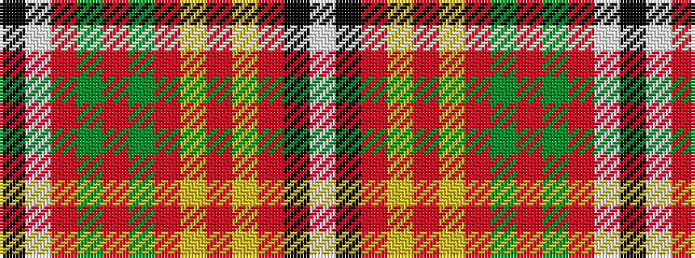

KWRGRGRYRYRKW

It is a 13 stripe tartan.

<figure class="pat-woven">

<figcaption>idealised sample</figcaption>
</figure>

## Colour Sequence



## Tartans with this colour sequence

| Tartans |
|---------------|
| [Melieres-Frost](/setts/s13/k4w1r2g16r8g8r15lo1r14ly2r2k1w4~x2/)|
||
