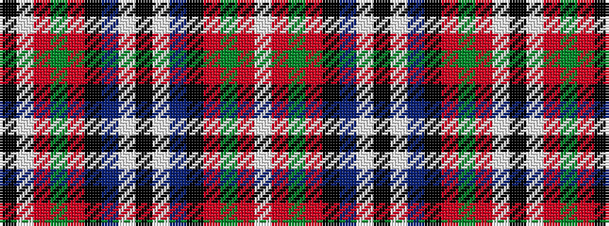

KWRGRKBWKWBKRGRW

It is a 16 stripe tartan.

<figure class="pat-woven">

<figcaption>idealised sample</figcaption>
</figure>

## Colour Sequence



## Tartans with this colour sequence

| Tartans |
|---------------|
| [Soutar/Souter](/setts/s16/k20w3t20k3r3dg20r10w3k20~x2/)|
||
