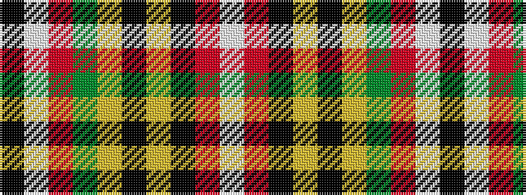

KWRGYKYKRW

It is a 10 stripe tartan.

<figure class="pat-woven">

<figcaption>idealised sample</figcaption>
</figure>

## Colour Sequence



## Tartans with this colour sequence

| Tartans |
|---------------|
| [Cape Breton Polish Society](/variants/s10/w3r28k1lr5k1lo3dg8r5w21k2~x2/)|
||
