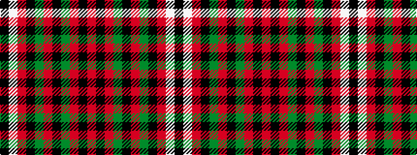

KWRKGRKGRKR

It is a 11 stripe tartan.

<figure class="pat-woven">

<figcaption>idealised sample</figcaption>
</figure>

## Colour Sequence



## Tartans with this colour sequence

| Tartans |
|---------------|
| [Valdres, Kvam & Vang #2](/variants/s11/k4w1r4k2g2r3k2g20r2k2r2~x2/)|
||
