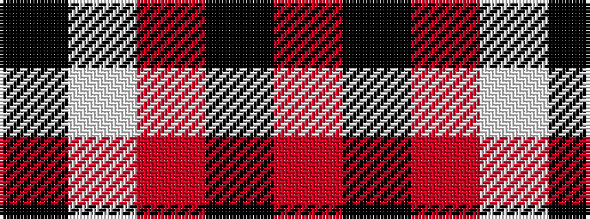

KWRKR

It is a 5 stripe tartan.

<figure class="pat-woven">

<figcaption>idealised sample</figcaption>
</figure>

## Colour Sequence



## Tartans with this colour sequence

| Tartans |
|---------------|
| [Loevenstein Castle](/variants/s5/r20k3r4lb2k7~x2/)|
||
| [Loevenstein Castle 1 (Artefact)](/variants/s5/r20k3r4w2k7~x2/)|
||
