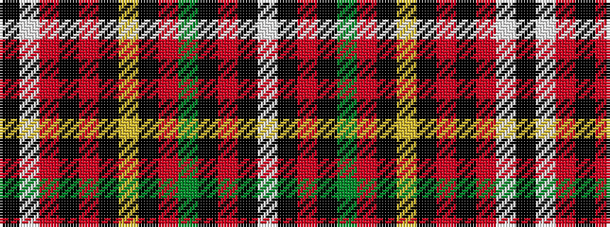

KWRKRKYKRGKRKW

It is a 14 stripe tartan.

<figure class="pat-woven">

<figcaption>idealised sample</figcaption>
</figure>

## Colour Sequence



## Tartans with this colour sequence

| Tartans |
|---------------|
| [Murphy, Andrew (Personal)](/setts/s14/k8lt2r2k6r2k2ly1k2r16dg30k1r2k4lt2~x2/)|
||
