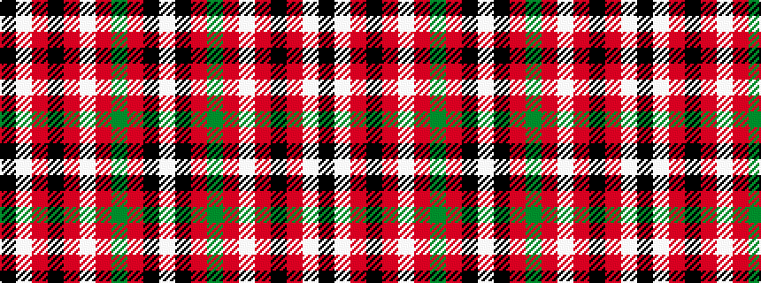

KWRKRWRGRKW

It is a 11 stripe tartan.

<figure class="pat-woven">

<figcaption>idealised sample</figcaption>
</figure>

## Colour Sequence



## Tartans with this colour sequence

| Tartans |
|---------------|
| [MacDonald of Glenaladale - 1772 (Cla](/variants/s11/k5lb2r50k50r5w2r5g42r50k5w2/)|
||
