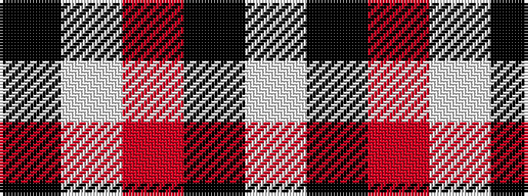

KWRKW

It is a 5 stripe tartan.

<figure class="pat-woven">

<figcaption>idealised sample</figcaption>
</figure>

## Colour Sequence



## Tartans with this colour sequence

| Tartans |
|---------------|
| [Shembe Zulu Church](/setts/s5/k5w25r6k45w4~x2/)|
||
