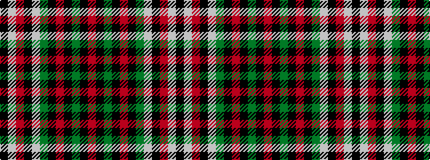

KWRKWGKRKGKR

It is a 12 stripe tartan.

<figure class="pat-woven">

<figcaption>idealised sample</figcaption>
</figure>

## Colour Sequence



## Tartans with this colour sequence

| Tartans |
|---------------|
| [Grant - 1714 (Piper) (Portrait)](/variants/s12/r24k2g8k2r8k1g24lb6k2r14lb18k4~x2/)|
||
