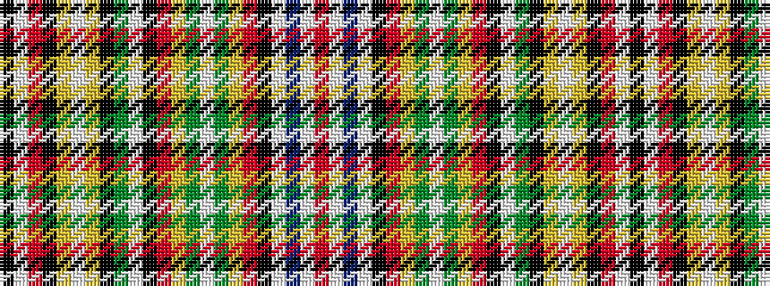

KWRKYWYKGWKRYGWGYRKWBWR

It is a 23 stripe tartan.

<figure class="pat-woven">

<figcaption>idealised sample</figcaption>
</figure>

## Colour Sequence



## Tartans with this colour sequence

| Tartans |
|---------------|
| [MacLeod of Gesto (Clan)](/setts/s23/r86w2t6w2k2r4ly2g4w2g4ly2r4k2w2g13k2ly2w2ly2k4r4w2k4~x2/)|
||
| [MacLeod of Gesto Clan Tartan Tartan Number: 1258. Earliest known date: pre 1850 Very similar to the sett recorded by Rhuriah MacLeod from a sample in a collection made for the Great Exhibition in London in 1851, now held by the Smith Institute in Stirling. The samples, made by Wilson's of Bannockburn, were donated to the institute anonymously in 1930. See products available Copyright © Blair Urquhart, Comrie, 2015](/setts/s23/r88w2t8w2k2r2ly2dy3w4dy3ly2r6k2w2g32k2ly2w2ly2k4r6w2k3~x2/)|
||
