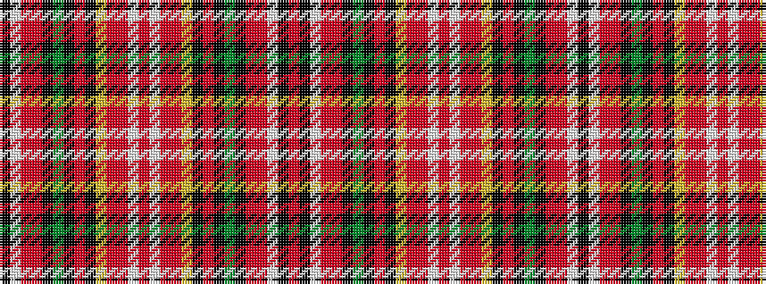

KWRRKGKRKYRRWRWRRYKRKGKRRWKR

It is a 28 stripe tartan.

<figure class="pat-woven">

<figcaption>idealised sample</figcaption>
</figure>

## Colour Sequence



## Tartans with this colour sequence

| Tartans |
|---------------|
| [Unidentified Scarlett #14](/setts/s28/r8w2r8o15ly1k15o8k1g1k1o8r8w2k2r3~x2/)|
||
