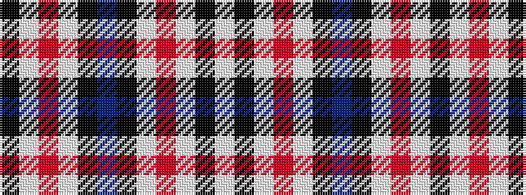

KWRWKBKWRWKW

It is a 12 stripe tartan.

<figure class="pat-woven">

<figcaption>idealised sample</figcaption>
</figure>

## Colour Sequence



## Tartans with this colour sequence

| Tartans |
|---------------|
| [Ferguson Dress Blue (Dance)](/variants/s12/t35k23w18r3w18k2w3~x2/)|
||
