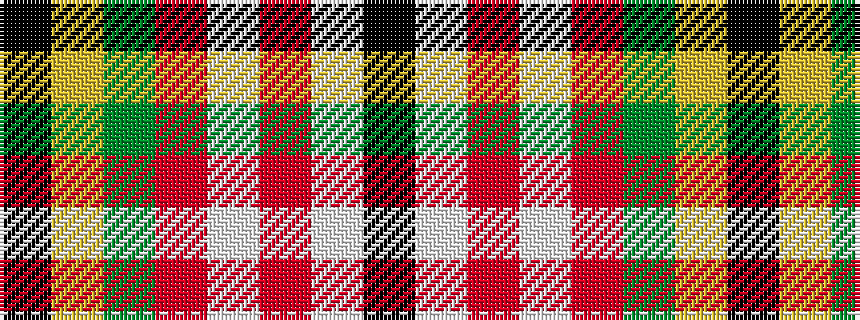

KWRWRGYK

It is a 8 stripe tartan.

<figure class="pat-woven">

<figcaption>idealised sample</figcaption>
</figure>

## Colour Sequence



## Tartans with this colour sequence

| Tartans |
|---------------|
| [Unidentified No 5](/setts/s8/k10ly2dg11r11w1r1w1k9~x2/)|
||
| [Unnamed No 5](/setts/s8/k10ly2g11r11w1r1w1k9~x2/)|
||
