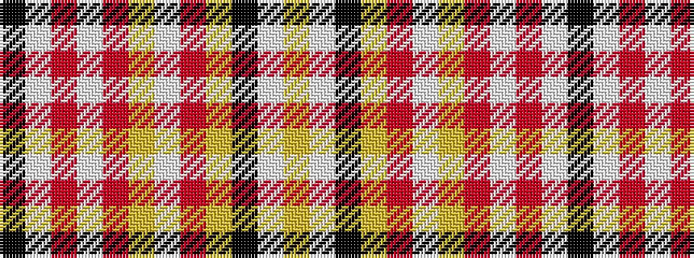

KWRWRYWRYKWY

It is a 12 stripe tartan.

<figure class="pat-woven">

<figcaption>idealised sample</figcaption>
</figure>

## Colour Sequence



## Tartans with this colour sequence

| Tartans |
|---------------|
| [Turblin, Jean Pierre (Personal)](/setts/s12/ly2w2k3ly1r8w6ly8r2w1r1w22k1~x2/)|
||
