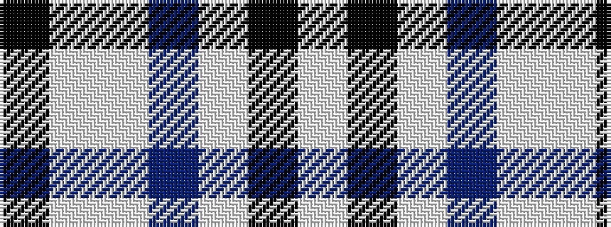

KWWBWKW

It is a 7 stripe tartan.

<figure class="pat-woven">

<figcaption>idealised sample</figcaption>
</figure>

## Colour Sequence



## Tartans with this colour sequence

| Tartans |
|---------------|
| [Strathclyde 1975 (District)](/setts/s7/k2lb16w2db16w15k2w2~x2/)|
||
| [Strathclyde District Tartan Tartan Number: 1072. Earliest known date: 1975 The navy blue and white are said to represent the 'Scottish Sporting Colours'. This sett is also produced with light blue in place of white. See products available Copyright © Blair Urquhart, Comrie, 2015](/setts/s7/k2lb16w2dt16w15k2w2~x2/)|
||
