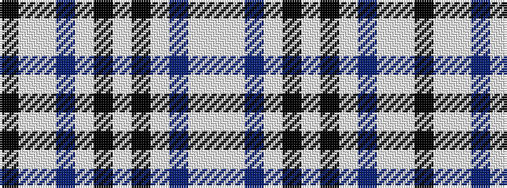

KWWBWKWKWBWW

It is a 12 stripe tartan.

<figure class="pat-woven">

<figcaption>idealised sample</figcaption>
</figure>

## Colour Sequence



## Tartans with this colour sequence

| Tartans |
|---------------|
| [Strathclyde (Official)](/variants/s12/lb16w2db16w15k2w2k2w15db16w2lb16k2~x2/)|
||
