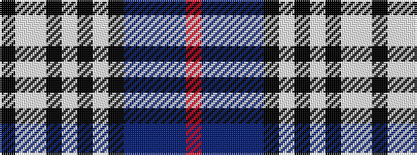

KWWKWKWKBBBBR

It is a 13 stripe tartan.

<figure class="pat-woven">

<figcaption>idealised sample</figcaption>
</figure>

## Colour Sequence



## Tartans with this colour sequence

| Tartans |
|---------------|
| [Anderson-Moffat (Personal)](/setts/s13/k5w10lb10k4lb4k4lb4k30dt21b4dt4b24r4/)|
||
