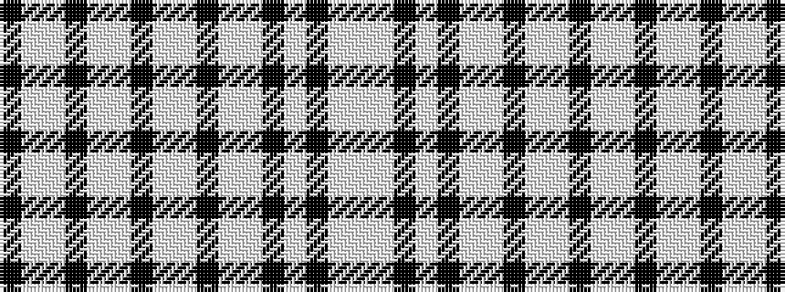

KWWKWWKWWKWWKWKWW

It is a 17 stripe tartan.

<figure class="pat-woven">

<figcaption>idealised sample</figcaption>
</figure>

## Colour Sequence



## Tartans with this colour sequence

| Tartans |
|---------------|
| [Purdy Black (Illinois)](/setts/s17/k20w1lp2k4w1lp3k4w1lp4k4w1lp5k3w1k54w1lp6~x2/)|
||
