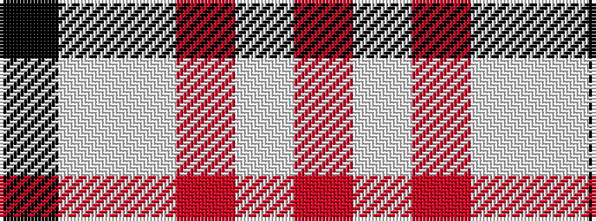

KWWRWR

It is a 6 stripe tartan.

<figure class="pat-woven">

<figcaption>idealised sample</figcaption>
</figure>

## Colour Sequence



## Tartans with this colour sequence

| Tartans |
|---------------|
| [MacGregor - 2005 (Black - Personal)](/variants/s6/r41w19r7w8w1k3~x2/)|
||
