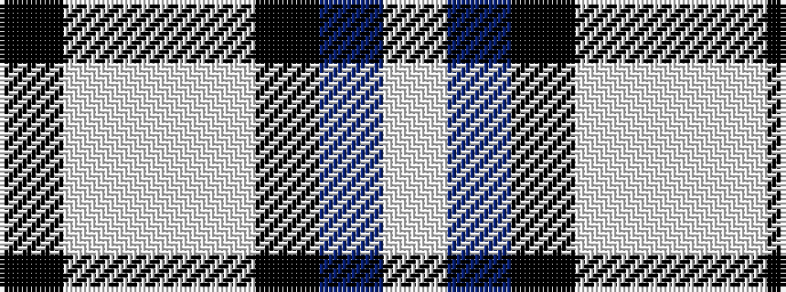

KWWWKBW

It is a 7 stripe tartan.

<figure class="pat-woven">

<figcaption>idealised sample</figcaption>
</figure>

## Colour Sequence



## Tartans with this colour sequence

| Tartans |
|---------------|
| [NHS Grampian (Corporate)](/setts/s7/k4w1lb2w1k16t36lb4~x2/)|
||
