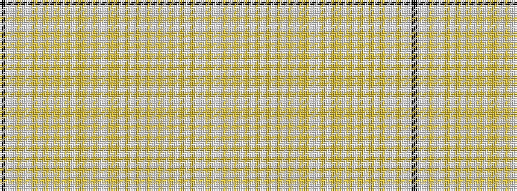

KWWYWWYWYWYWYWYYWYWWYYWYWYWYWYWYWYWYWWY

It is a 39 stripe tartan.

<figure class="pat-woven">

<figcaption>idealised sample</figcaption>
</figure>

## Colour Sequence



## Tartans with this colour sequence

| Tartans |
|---------------|
| [Shapiro (Personal)](/variants/s39/k16lb2lp2ly2lp10lb4ly6lb10ly6lb10ly4lb10ly4lb10ly1ly1lb32ly2lb10lp4ly10ly4lb10ly10lb6ly10lb6ly10lb6ly10lb4ly10lb2ly28lb3ly10lp6lb4ly16~x2/)|
||
