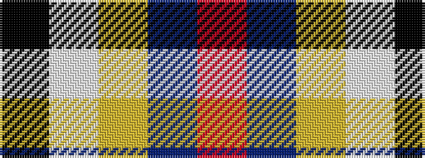

KWYBR

It is a 5 stripe tartan.

<figure class="pat-woven">

<figcaption>idealised sample</figcaption>
</figure>

## Colour Sequence



## Tartans with this colour sequence

| Tartans |
|---------------|
| [Cornish, National Day](/variants/s5/k5w2ly36b47r3~x2/)|
||
| [Oliver Dress Pink](/variants/s5/k5w2ly36t47r3~x2/)|
||
