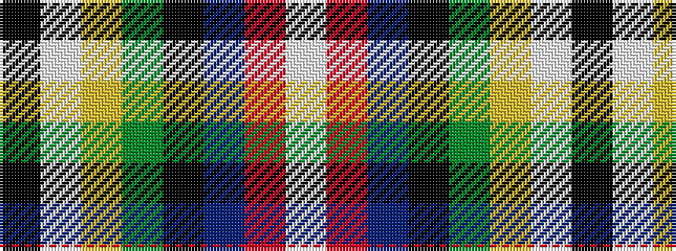

KWYGKBRW

It is a 8 stripe tartan.

<figure class="pat-woven">

<figcaption>idealised sample</figcaption>
</figure>

## Colour Sequence



## Tartans with this colour sequence

| Tartans |
|---------------|
| [Kaptain Family (Personal)](/setts/s8/k1w1ly2dg1k10db1r2w1~x10/)|
||
