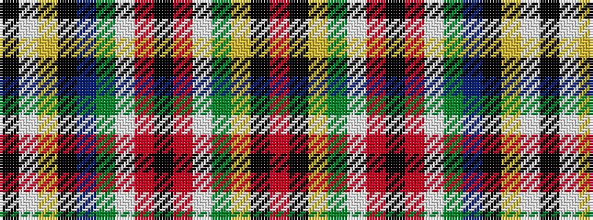

KWYKBGWRKRWGYKR

It is a 15 stripe tartan.

<figure class="pat-woven">

<figcaption>idealised sample</figcaption>
</figure>

## Colour Sequence



## Tartans with this colour sequence

| Tartans |
|---------------|
| [Elmore (Personal)](/setts/s15/r29k1lo3dg6w6r3k1r3w2dg3db5k3ly5w5k4~x2/)|
||
