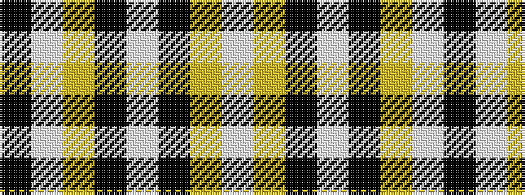

KWYKWKYW

It is a 8 stripe tartan.

<figure class="pat-woven">

<figcaption>idealised sample</figcaption>
</figure>

## Colour Sequence



## Tartans with this colour sequence

| Tartans |
|---------------|
| [Colbert Check (Fashion)](/variants/s8/k62w10ly10k4w18k4lo3w4/)|
||
