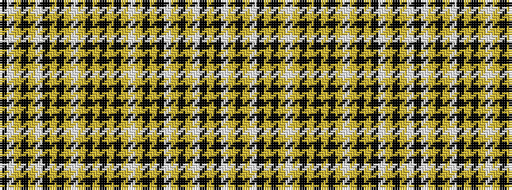

KWYKYWKYKYWYKYKYKYWYKYKWYKYWKY

It is a 30 stripe tartan.

<figure class="pat-woven">

<figcaption>idealised sample</figcaption>
</figure>

## Colour Sequence



## Tartans with this colour sequence

| Tartans |
|---------------|
| [Corps Suevia Heidelburg](/setts/s30/ly21k2lb2ly2k2ly2lb2k2ly2k2ly2lb6ly2k2ly3k20~x2/)|
||
