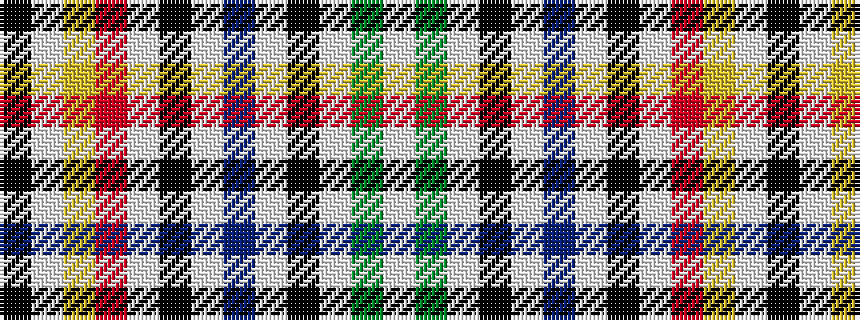

KWYRWKWBWKWGW

It is a 13 stripe tartan.

<figure class="pat-woven">

<figcaption>idealised sample</figcaption>
</figure>

## Colour Sequence



## Tartans with this colour sequence

| Tartans |
|---------------|
| [Hovington (2014)](/variants/s13/k2w1lo6r6w1k2lb2do3lb2k1lb2g3lb2~x2/)|
||
