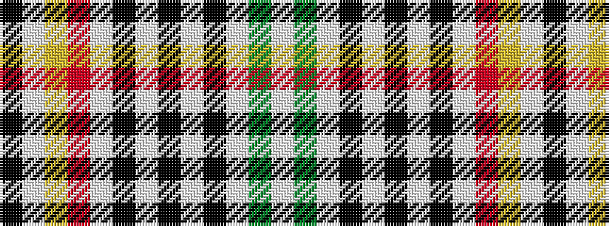

KWYRWKWKWKWGW

It is a 13 stripe tartan.

<figure class="pat-woven">

<figcaption>idealised sample</figcaption>
</figure>

## Colour Sequence



## Tartans with this colour sequence

| Tartans |
|---------------|
| [Hovington (2014)](/setts/s13/k2w1ly6r6w1k2w2k3w2k1w2g3w2~x4/)|
||
