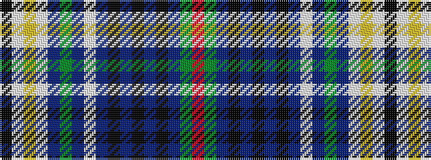

KWYWBGBWBKBKBKBGR

It is a 17 stripe tartan.

<figure class="pat-woven">

<figcaption>idealised sample</figcaption>
</figure>

## Colour Sequence



## Tartans with this colour sequence

| Tartans |
|---------------|
| [Kennedy](/variants/s17/k8w9ly6w10p5g6p5w36db8k8db8k8db8k8db8g38r8/)|
||
