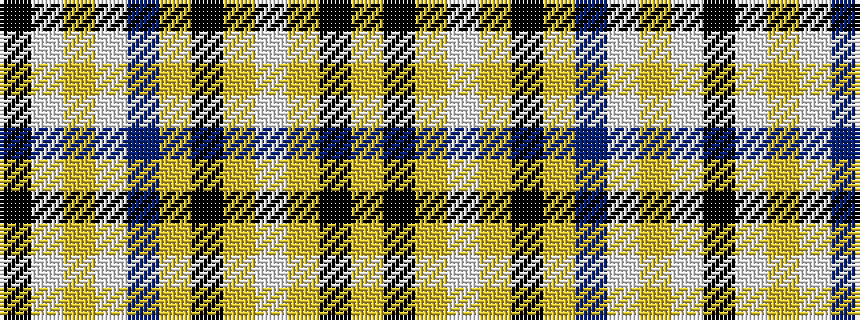

KWYWBYKYWYKY

It is a 12 stripe tartan.

<figure class="pat-woven">

<figcaption>idealised sample</figcaption>
</figure>

## Colour Sequence



## Tartans with this colour sequence

| Tartans |
|---------------|
| [London Fog Camel (Fashion)](/variants/s12/lr144k9lr13lb9lr4k9lr4t13lb13lr4lb13k4/)|
||
