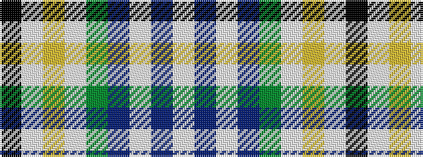

KWYWGBWBW

It is a 9 stripe tartan.

<figure class="pat-woven">

<figcaption>idealised sample</figcaption>
</figure>

## Colour Sequence



## Tartans with this colour sequence

| Tartans |
|---------------|
| [Ofsharick, Matthew (Personal)](/setts/s9/lb55t8w8t8g5lb8ly4w4k4~x2/)|
||
