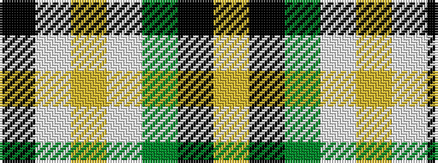

KWYWGKY

It is a 7 stripe tartan.

<figure class="pat-woven">

<figcaption>idealised sample</figcaption>
</figure>

## Colour Sequence



## Tartans with this colour sequence

| Tartans |
|---------------|
| [Black & White Golf (Corporate)](/setts/s7/lo9k32g6lb20lo3lb9k5~x2/)|
||
| [Black and White Golf](/setts/s7/ly9k32g6w20ly3w9k5~x2/)|
||
