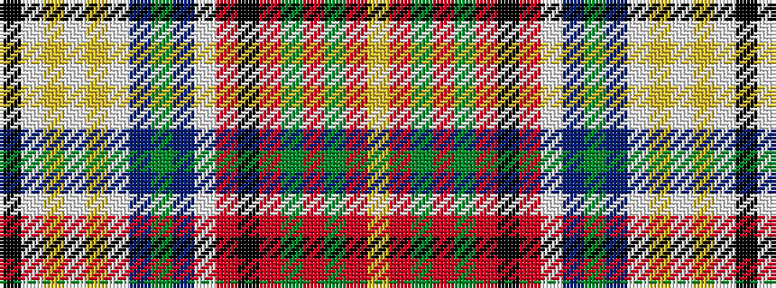

KWYWYWBGBWRKRGRGRY

It is a 18 stripe tartan.

<figure class="pat-woven">

<figcaption>idealised sample</figcaption>
</figure>

## Colour Sequence



## Tartans with this colour sequence

| Tartans |
|---------------|
| [Harmon Dress](/setts/s18/k2lb6ly2lb2ly2lb19n2dg2n2lb2r4k2r11dg2r2dg2r6ly2~x2/)|
||
