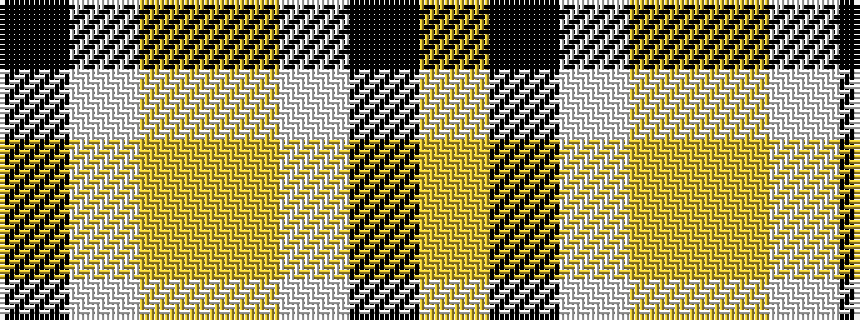

KWYYWKY

It is a 7 stripe tartan.

<figure class="pat-woven">

<figcaption>idealised sample</figcaption>
</figure>

## Colour Sequence



## Tartans with this colour sequence

| Tartans |
|---------------|
| [Virginia Commonwealth University](/setts/s7/k30w2lr4lo10w9k3lr5~x2/)|
||
