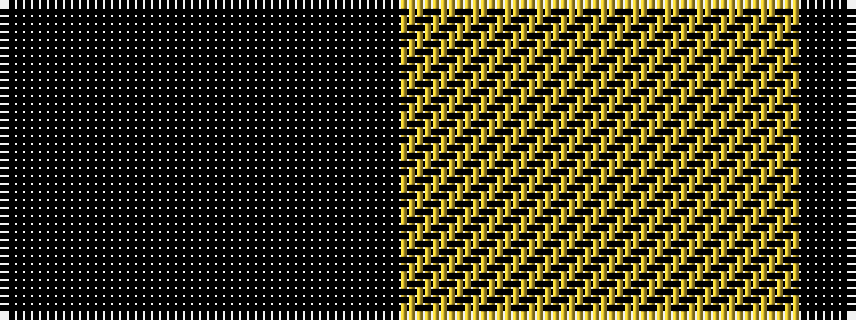

KY

It is a 2 stripe tartan.

<figure class="pat-woven">

<figcaption>idealised sample</figcaption>
</figure>

## Colour Sequence



## Tartans with this colour sequence

| Tartans |
|---------------|
| [Justus Check (Personal)](/setts/s2/k1ly1~x40/)|
||
| [Justus Check (Personal)](/setts/s2/k1ly1~x50/)|
||
| [Shepherd](/setts/s2/k1lr1/)|
||
