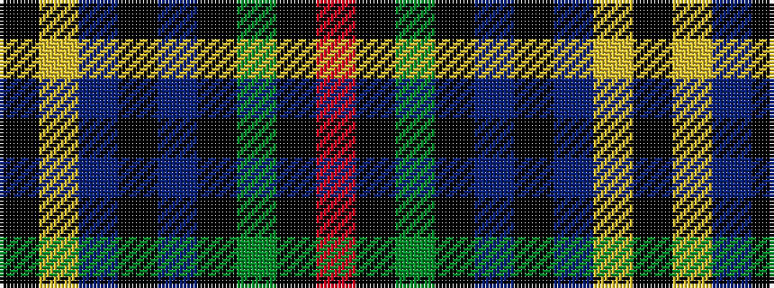

KYBKBKGKR

It is a 9 stripe tartan.

<figure class="pat-woven">

<figcaption>idealised sample</figcaption>
</figure>

## Colour Sequence



## Tartans with this colour sequence

| Tartans |
|---------------|
| [Red Chapeau](/variants/s9/r9k1g1k1dp6k1dp6ly1k2~x6/)|
||
