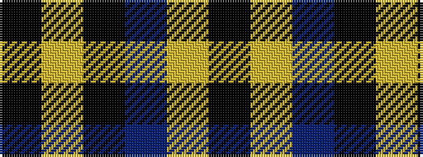

KYBKYK

It is a 6 stripe tartan.

<figure class="pat-woven">

<figcaption>idealised sample</figcaption>
</figure>

## Colour Sequence



## Tartans with this colour sequence

| Tartans |
|---------------|
| [Stutterheim](/setts/s6/k4ly18n44k3ly10k4/)|
||
| [Stutterheim (Corporate)](/setts/s6/k4ly18db44k3ly10k4/)|
||
