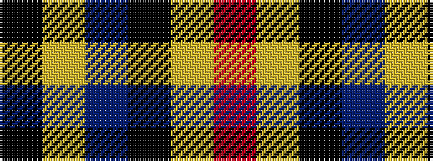

KYBKYR

It is a 6 stripe tartan.

<figure class="pat-woven">

<figcaption>idealised sample</figcaption>
</figure>

## Colour Sequence



## Tartans with this colour sequence

| Tartans |
|---------------|
| [Double Elvis Gallery](/variants/s6/r80lr30k3p2lr30k12/)|
||
