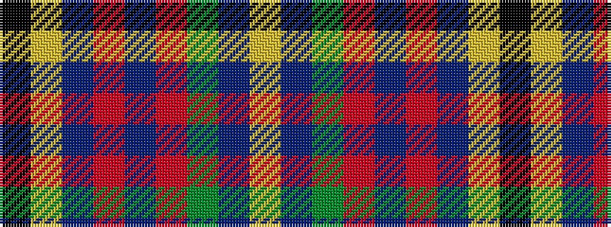

KYBRBRGBY

It is a 9 stripe tartan.

<figure class="pat-woven">

<figcaption>idealised sample</figcaption>
</figure>

## Colour Sequence



## Tartans with this colour sequence

| Tartans |
|---------------|
| [Coats (New Zealand)](/setts/s9/k9lo6db9o2do3o2dg17db17lg5~x2/)|
||
