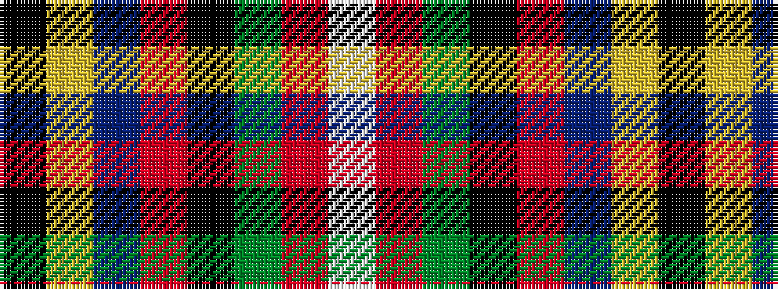

KYBRKGRW

It is a 8 stripe tartan.

<figure class="pat-woven">

<figcaption>idealised sample</figcaption>
</figure>

## Colour Sequence



## Tartans with this colour sequence

| Tartans |
|---------------|
| [Spirit of Lanarkshire (Corporate)](/variants/s8/k83ly2db4r2k8g5r4w3~x2/)|
||
