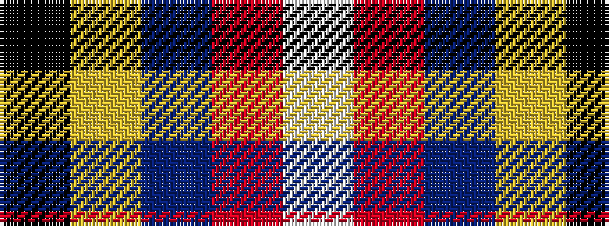

KYBRW

It is a 5 stripe tartan.

<figure class="pat-woven">

<figcaption>idealised sample</figcaption>
</figure>

## Colour Sequence



## Tartans with this colour sequence

| Tartans |
|---------------|
| [Douglas Ancient Red](/setts/s5/k8lo2n30r30lb3~x2/)|
||
