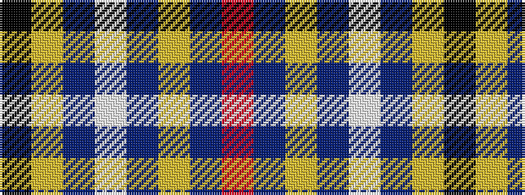

KYBWBYBR

It is a 8 stripe tartan.

<figure class="pat-woven">

<figcaption>idealised sample</figcaption>
</figure>

## Colour Sequence



## Tartans with this colour sequence

| Tartans |
|---------------|
| [Royal Yaght Britannia, The](/setts/s8/k43ly3n1w1db1ly3db25r2~x2/)|
||
