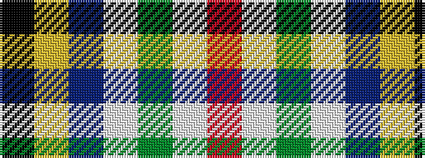

KYBWGWR

It is a 7 stripe tartan.

<figure class="pat-woven">

<figcaption>idealised sample</figcaption>
</figure>

## Colour Sequence



## Tartans with this colour sequence

| Tartans |
|---------------|
| [South Africa 1994 (Fashion)](/variants/s7/k20ly4db13w4g30w4r13~x2/)|
||
