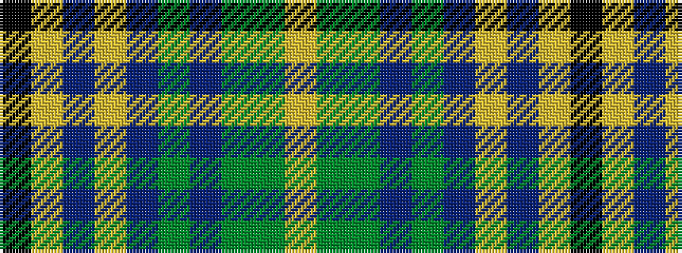

KYBYBGBGGY

It is a 10 stripe tartan.

<figure class="pat-woven">

<figcaption>idealised sample</figcaption>
</figure>

## Colour Sequence



## Tartans with this colour sequence

| Tartans |
|---------------|
| [Auld Scotland Weavers Tartan](/variants/s10/k2lo12dr3lo3dr12yi12n12y12yi1ly2~x2/)|
||
