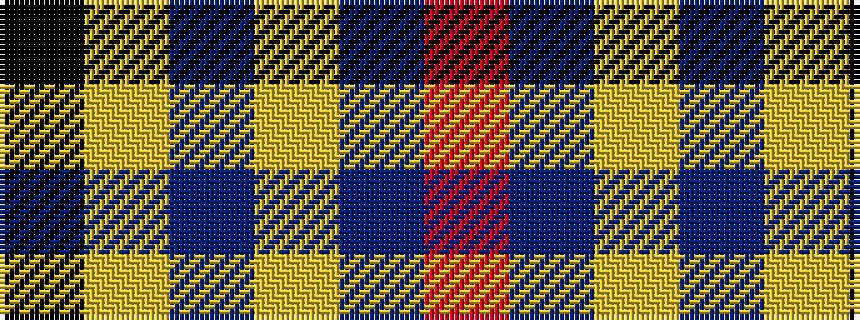

KYBYBR

It is a 6 stripe tartan.

<figure class="pat-woven">

<figcaption>idealised sample</figcaption>
</figure>

## Colour Sequence



## Tartans with this colour sequence

| Tartans |
|---------------|
| [Kendle (2013)](/variants/s6/r5db58lr4t6ly4k4~x2/)|
||
